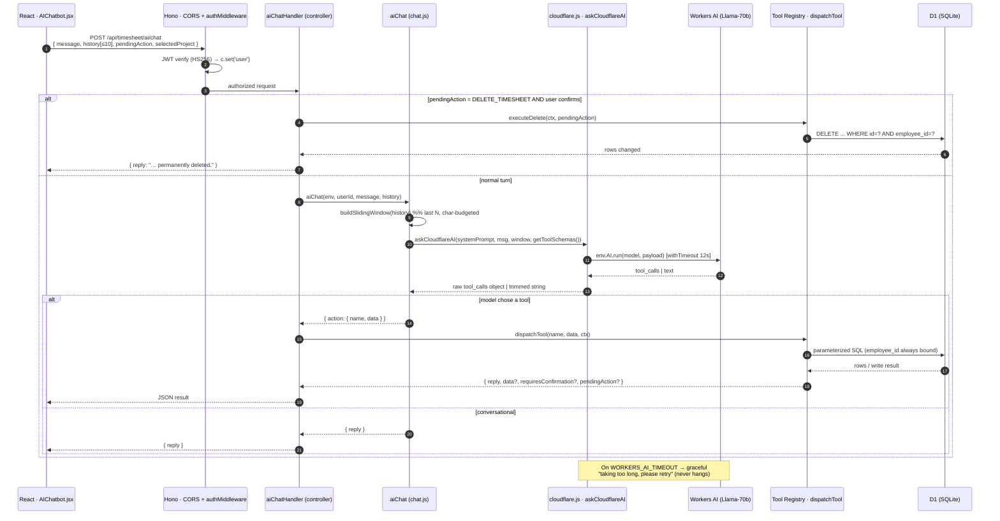
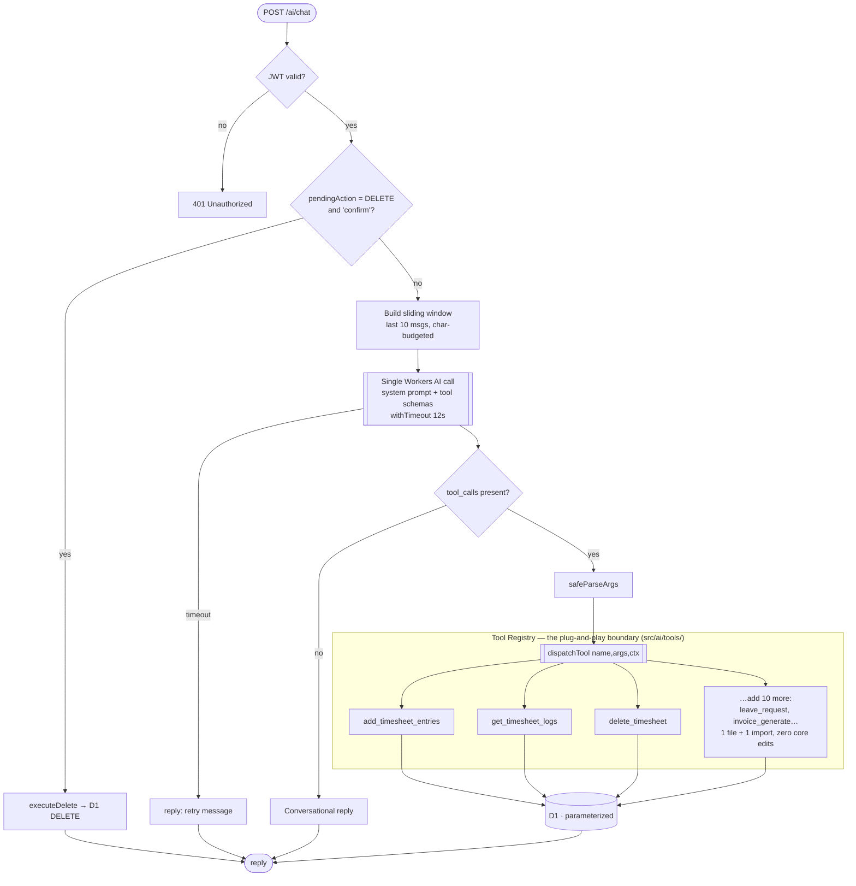
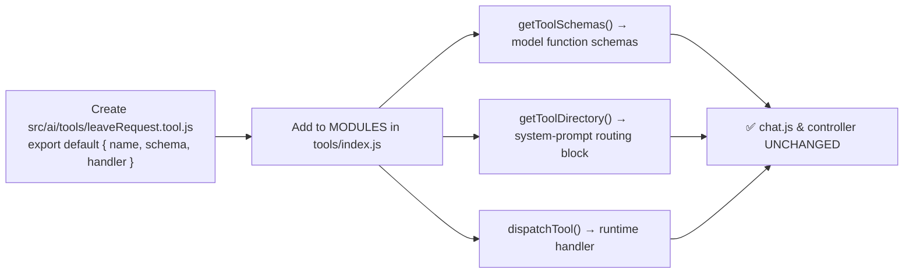

# Agentic AI Timesheet — Architecture

This document describes the **request lifecycle** of the AI timesheet agent after the
production-hardening pass: a single LLM round-trip, sliding-window memory, a
plug-and-play tool registry, and parameterized DB access only (no LLM-generated SQL).

- **Frontend:** React (`AIChatbot.jsx`)
- **Edge runtime:** Hono on Cloudflare Workers
- **Model:** Workers AI — `@cf/meta/llama-3.3-70b-instruct-fp8-fast` (native tool calling)
- **DB:** Cloudflare D1 (SQLite)

---

## 1. Request Lifecycle (sequence)

---

## 2. Decision Flow (routing + plug-and-play boundary)

---

## 3. Plug-and-Play: adding a tool

Everything the model sees and everything the runtime dispatches is **derived from one
array** in `src/ai/tools/index.js`. Adding capability is a closed, local change:

**Contract for a tool module:**

| Export | Shape | Purpose |
|--------|-------|---------|
| `name` | `string` | Stable tool id (matches `schema.name`). |
| `schema` | `{ name, description, parameters }` | OpenAI/Llama function-calling schema. |
| `handler` | `async (ctx, args) => result` | Executes the action. `ctx = { db, user, env, selectedProject, today }`. Returns `{ reply, … }`, or `{ requiresConfirmation, pendingAction, reply }` for destructive ops. |

---

## 4. Key invariants (why this is safe & fast)

| Concern | Mechanism | Location |
|---------|-----------|----------|
| **No SQL injection / exfiltration** | Model never emits SQL. Every query is parameterized; `employee_id` is always bound to the JWT user. | `src/ai/tools/*.tool.js` |
| **Latency / timeout** | One LLM round-trip per turn (was up to 3). Hard 12s `withTimeout` on the model call → graceful fallback. | `chat.js`, `cloudflare.js` |
| **Token bloat** | Sliding window: last `MAX_HISTORY_MESSAGES` (10), evict-oldest until under `MAX_TOTAL_CHARS`. | `chat.js`, `ai-config.js` |
| **Memory** | Frontend forwards prior `{role,content}` turns; backend windows them into the prompt. | `AIChatbot.jsx`, `chat.js` |
| **Destructive safety** | Delete is two-phase: locate + confirm, then `executeDelete` on an explicit "confirm". | `deleteTimesheet.tool.js`, controller |
| **No year hardcode** | `isValidEntryDate()` validates real calendar dates; future dates clamp to today. | `tools/_helpers.js` |

---

## 5. Configuration knobs (`src/ai/ai-config.js`)

| Constant | Default | Effect |
|----------|---------|--------|
| `MAX_HISTORY_MESSAGES` | `10` | Conversational memory depth (≈5 turns). |
| `MAX_TOTAL_CHARS` | `52000` | Char budget for the windowed context. |
| `MAX_MESSAGE_CHARS` | `4000` | Single-message size cap. |
| `AI_TIMEOUT_MS` | `12000` | Hard ceiling on a Workers AI call. |
| `CHAT_MODEL` | `llama-3.3-70b…fp8-fast` | Routing + extraction model. |
